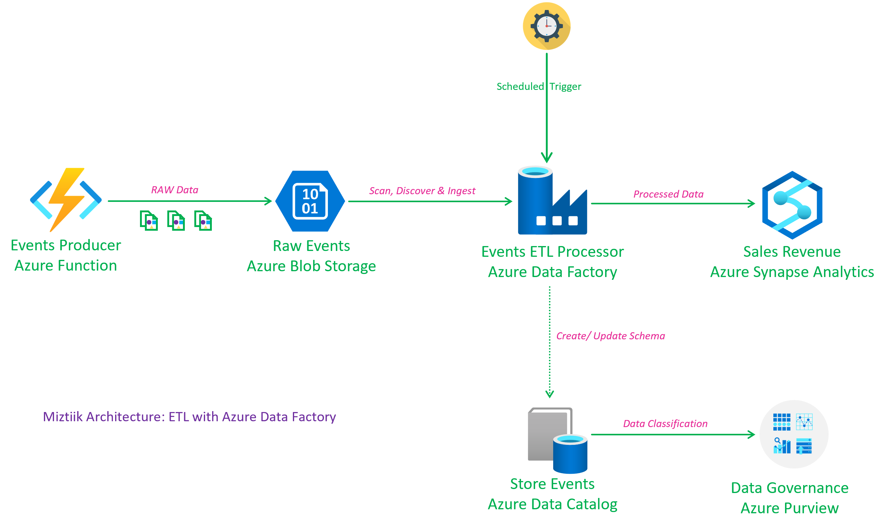

# ETL with Azure Data Factory

Given the number of moving pieces and complexity, it is better for video format than a blog format to have a meaningful demo written and automated. Until i find time for that - this repo is a work in progress.

The stack in this repo will deploy a data factory, a storage account, and a producer to generate events. You can use that build a dat factory pipeline to ingest the events into a synapse table and query them.

- Create the data factory

